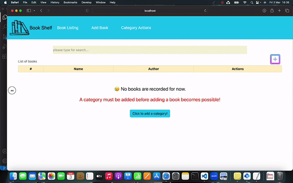

Your Book Shelf at Home

User can add, delete, edit books and categories as his/her wish and search for the books in bookshelf

- #reactjs ;
🎣 #axios : used as an instance for typos (create baseURL, api, urls)for rest api actions
🗽 state management with react, #react-redux
🔄 generic reusable #components (CustomModal for error handling and getting validation from user in delete and edit functions )
* functions under utils file for #input validation and for a better user experience
* #jsx syntax
* #hooks (#useEffect, #useState, #useNavigate, #useParams  )
* #json -server as back-end data storage
* #UI : #responsivewebdesign , interactive UIs with react, #bootstrap, animated icons added
* #React-router-dom for navigation between pages.

